## 📊 GitHub Activity & Statistics

---

## 🎯 What I Care About

- Designing systems that **scale and survive production**
- Eliminating manual processes through **automation**
- Applying **AI pragmatically**, not experimentally
- Clean architecture, observability, and long-term maintainability

---

## 🤝 Open To

- Senior / Staff-level engineering roles
- Backend-heavy full-stack work
- AI-enhanced platform development
- Complex problem spaces with real-world constraints

---

> _“Software should reduce complexity — not create it.”_
